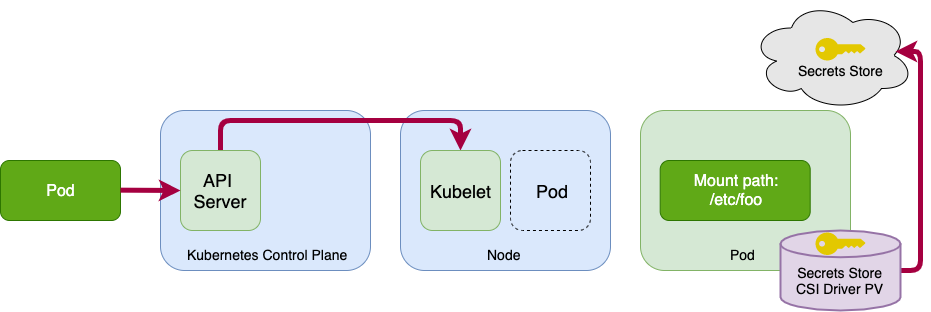

# Kubernetes Secrets

## Comparison and trade offs on secret tools

1. https://github.com/external-secrets/kubernetes-external-secrets
2. https://aws.amazon.com/blogs/security/how-to-use-aws-secrets-configuration-provider-with-kubernetes-secrets-store-csi-driver/

Both of these tools can retrieve secrets from AWS secrets.  The main difference are how the secrets are
accessed and presented to the pod.

| Feature                                         | kubernetes-external-secrets | kubernetes-secrets-store-csi-driver |
|-------------------------------------------------|-----------------------------|-------------------------------------|
| Can mount secret to a specific pod              |              no             |                 yes                 |
| Authentication and authorization to AWS Secrets |           IAM Role          |               IAM Role              |
| Can add secret to Kubernetes secret             |             yes             |                 yes                 |
| Can get secrets from Vault                      |             yes             |                  no                 |


### kubernetes-secrets-store-csi-driver


While it seems that the `kubernetes-secrets-store-csi-driver` is more secure because it can mount the secret directly
into a pod, we should look at the mechanism that enables this to evaluate how secure it is.

With the `kubernetes-secrets-store-csi-driver` the pod is given access to a `serviceAccountName`.  This `ServiceAccount`
has the identity that is given the AWS IAM permissions to get this secret:

```yaml
kind: Pod
apiVersion: v1
metadata:
  name: nginx-secrets-store-inline
spec:
  serviceAccountName: aws-node
  containers:
  - image: nginx
    name: nginx
    volumeMounts:
    - name: mysecret2
      mountPath: "/mnt/secrets-store"
      readOnly: true
  volumes:
    - name: mysecret2
      csi:
        driver: secrets-store.csi.k8s.io
        readOnly: true
        volumeAttributes:
```

The pod uses this `ServiceAccount` as the identity to assume the IAM role.  It then uses this to fetch
the AWS Secret and mounts it as a storage volume inside the pod's container via an in memory storage
volume.  This secret never gets written to the underlying node's disk.

This sounds good and checks off a few boxes:
1. It is never written to the disk
1. Only this pod has the secret storage volume attached to the pod
1. Makes it harder for kubernetes cluster-admins or namespace admins to read this secret but not impossible
1. It is not using Kubernetes secret where any items in the same namespace can read

Let's dig into: `Makes it harder for kubernetes cluster-admins or namespace admins to read this secret but not impossible`

You can't just do a `kubectl get secret mysecret -o yaml` and get the secret.

You can `kubectl exec` into the pod to get the secret.

No shell?  You can then just launch another pod in the namespace to go and fetch the secret.  A little bit harder
but not by much.

Let's dig into: `It is not using Kubernetes secret where any items in the same namespace can read`

Sure, other pods can't easily go and get the secret from the kubernetes secrets and read it like the last statement.

However, a secret is only as secure as your first inital access point and this first initial access point for
either solution is the Kubernetes `ServiceAccount` in the same namespace.  If you have this and know where
the secret is, you can use this identity and assume the IAM role to get the secret value.

You can say this is security by obscurity but that isn't really security at all.  Just because you can't easily
see the open window, it doesn't mean it is not there.


### external-secrets
Let's run through how `external-secrets` retrieves the secret.  


The External Secrets Controller has fetches your secrets and places them into the Kubernetes
secrets.  This means that this items will have to be able to assume various IAM roles.

To tell `external-secrets` to get an AWS secret you add in an `ExternalSecret` CRD to your
namespace.  The `external-secrets` controller is responsible for handling these resources:

```yaml
apiVersion: kubernetes-client.io/v1
kind: ExternalSecret
metadata:
  name: hello-service
spec:
  backendType: secretsManager
  # optional: specify role to assume when retrieving the data
  roleArn: arn:aws:iam::123456789012:role/test-role
  # optional: specify region
  region: us-east-1
  data:
    - key: hello-service/credentials
      name: password
      property: password
```

You pass it a `roleArn` and it will assume this role to try and fetch your secret with.  If
successful, it will write it to a Kubernetes secret.  

Kubernetes secret's attributes:
* They are stored in the Kubernetes etcd database and it has encryption at rest
* Envelope encryption can be added on with your own decryption key if desired: https://aws.amazon.com/blogs/containers/using-eks-encryption-provider-support-for-defense-in-depth/

This makes it reasonably secure and you are mainly worried about access to it.

To further limit access to what IAM roles a namespace can retrieve, you can set and
enforce annotations on the namespace level to a set of roles.  This will allow you
to scope access more granulary:

```yaml
kind: Namespace
metadata:
  name: iam-example
  annotations:
    # annotation key is configurable
    iam.amazonaws.com/permitted: "arn:aws:iam::123456789012:role/.*"
```

This sounds good and checks off a few boxes:
1. It is written to the disk via Kubernetes secrets but it can be encrypted a few times
1. Only valid users/accounts can access this secret in AWS Secret

However, it doesnt check off these boxes like the other one:
1. Only this pod has the secret storage volume attached to the pod
1. Makes it harder for kubernetes cluster-admins or namespace admins to read this secret but not impossible
1. It is not using Kubernetes secret where any items in the same namespace can read

`Only this pod has the secret storage volume attached to the pod`
* We outlined this above.  While this sounds nice it is really just a few indirections from the actual secret
* You can still get to the secret just like this pod did by using the same Kubernetes `ServiceAccount`

`Makes it harder for kubernetes cluster-admins or namespace admins to read this secret but not impossible`
* Yes, this method it is easier to read the actual secret
* This is just security by obscurity check box

`It is not using Kubernetes secret where any items in the same namespace can read`
* True, however, just like the above points, you can still get at the secret via the Kubernetes `ServiceAccount`

## Overall assessment
Both of these methods are about the same since they both start from the source which is
the Kubernetes `ServiceAccount` and from there that has the identity to assum IAM roles to get
at the secret.

Both method has the same "initial unlock" flow to it.

For either method to secure from anyone or pod having access to the initial `ServiceAccount` you will have to isolate
the pod into it's own namespace and then control who has access to this namespace.  By doing this, you control who
has access the namespace which means you can restrict who has access to the `ServiceAccount` in that namespace that
is used to assume the role that has access to get the AWS secret.

The benefit of the `external-secret` is that it can support various secret backends and not just AWS Secrets and it
is slightly easier to use from a secret's users perspective.  It is all Kubernetes resources.
