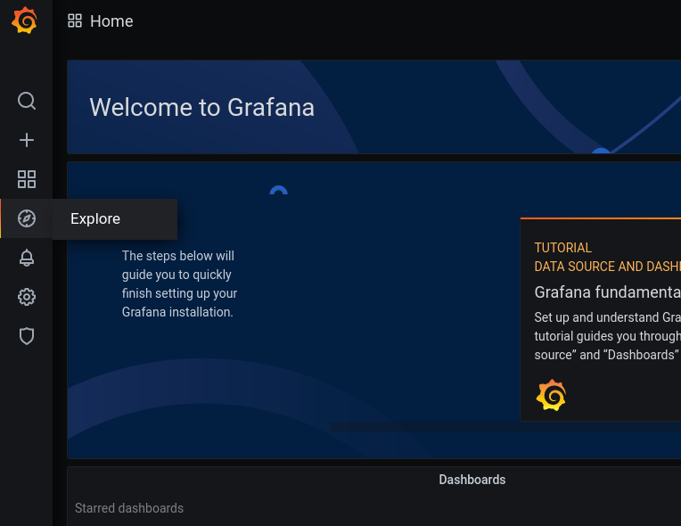
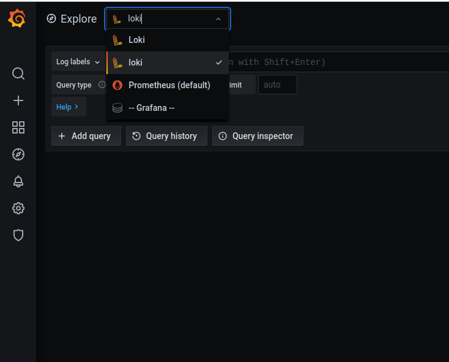
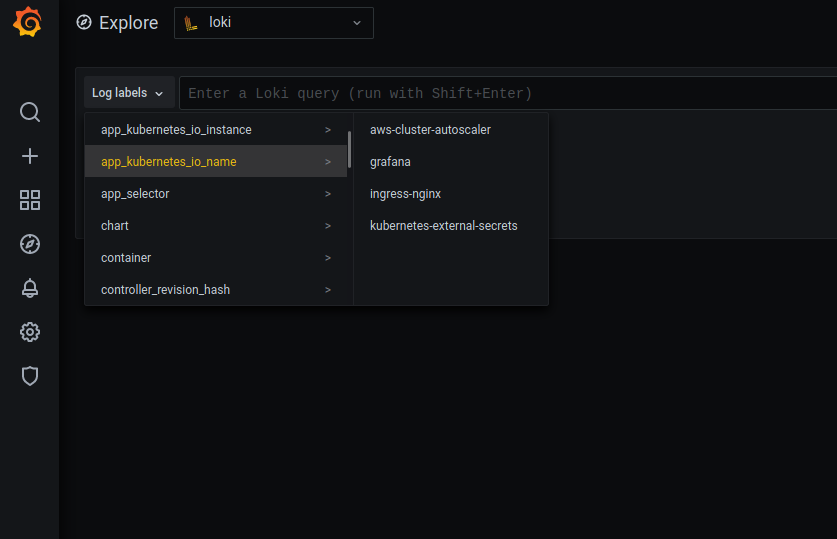
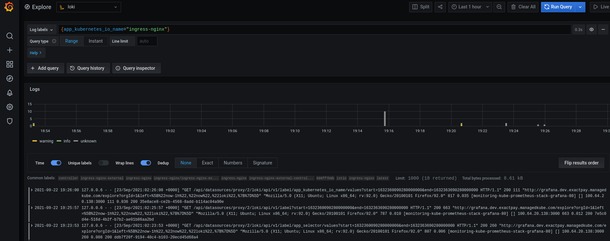
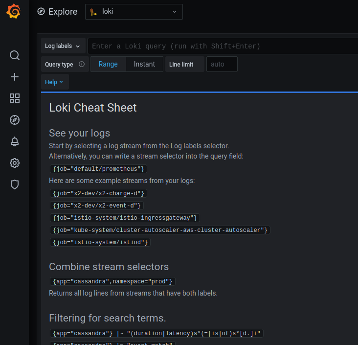

# Observability

## Logs
Loki is a centralized log server that uses Grafana as the frontend UI.

### How to:

#### Get to the logging area
Go to the `Explore` menu item on the left



Select the datasource `loki`:



#### Searching

##### All logs by a label
You can get all the logs for items that has a certain label.  Kubernetes lets you add labels to your
application deployment.  This label can be something specific to your app like `app_selector=my-app`
or something specific to an environment such as `env=dev`.

Tip:
* These Kubernetes labels are arbitrary
* They are here to help you find things that you are interested in
* You should add labels to your deployments that aggregates the data into how you want to search for them
* The same labels are also captured by Prometheus which means you can search for logs and metrics with the same labels



After clicking on one of these your search appears in the search field and the logs appear below that:



##### Adding filters
Now that you have all of the logs for the item that you want, you will most likely want to filter it
to something that you are interested in looking for.  Loki uses a pipe like syntax and regex.

If you want to search for everything with the word `error`:
```
{app_kubernetes_io_name="ingress-nginx"} |~ "error"
```

If you want to search for everything with the word `error` in any case (upper or lower):
```
{app_kubernetes_io_name="ingress-nginx"} |~ "(?i)error"
```

If you want to search for everything with the word `error` or `warn` in a case
insensitive way: 
```
{app_kubernetes_io_name="ingress-nginx"} |~ "(?i)error|warn"
```

Everything after the `|~` is regex.  You can google for a regex cheat sheet and use that to
help you with the searching syntax

##### Loki Help
The Loki LogQL docs: https://grafana.com/docs/loki/latest/logql/

There is `help` button that expands the searching help menu which can help you get started.




## Metrics
Prometheus
