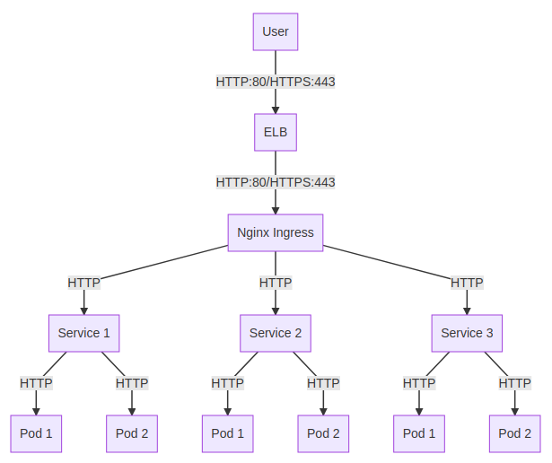

nginx-ingress
===============

Source helm chart:  https://github.com/helm/charts/tree/master/stable/nginx-ingress

# Topology this creates



# Why an external and internal nginx-ingress?
The `internal` is set with to us an internal ELB.  This ELB will have an private
IP address reachable only from your internal network.

The `external` has a public IP address that is reachable from anywhere from
the internet.

Launching both of these will create two setups of the above diagram.  The external
setup is usually for your traffic to your application that you want external
users to be able to access (like your customers).

The internal setup is for internal items which internal users should only have
access to such as employees.  Items like Prometheus monitoring, Grafana, or
any other internal only applications you are running on the cluster.

# Usage:

## internal

### template
```
make ENVIRONMENT=dev internal-template
```

### apply
```
make ENVIRONMENT=dev internal-apply
```

### delete
```
make ENVIRONMENT=dev internal-delete
```

## external

### template
```
make ENVIRONMENT=dev external-template
```

### apply
```
make ENVIRONMENT=dev external-apply
```

### delete
```
make ENVIRONMENT=dev external-delete
```

# Ingress usage:
An annotation on the ingress needs to be placed on every ingress:

External routes:
```
annotations:
  kubernetes.io/ingress.class:: nginx-external
```

Internal routes:
```
annotations:
  kubernetes.io/ingress.class:: nginx-internal
```
