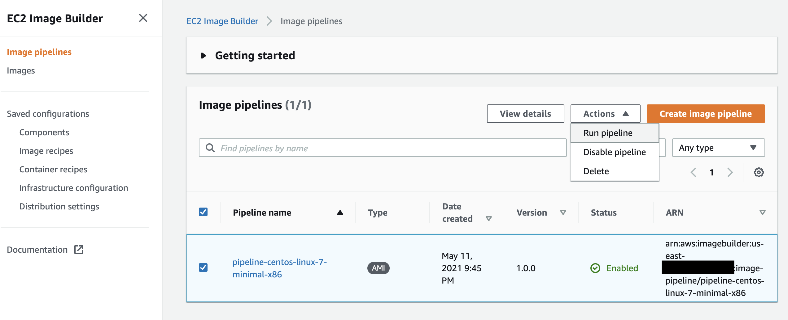
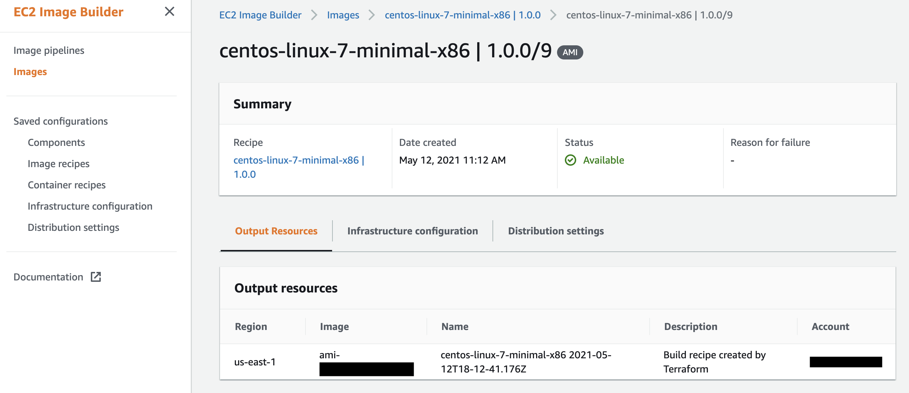
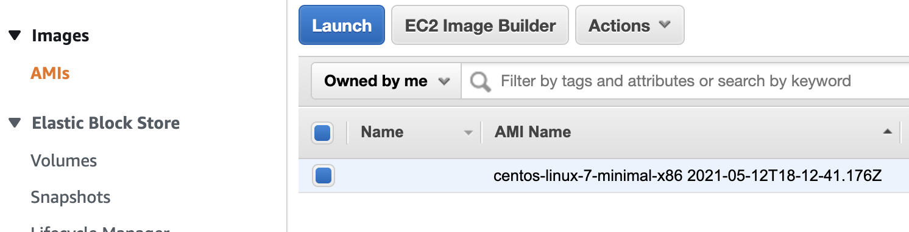

# Image Builder
This image builder uses a Terraform module called `imagebuilder` to create a EC2 Build Image pipeline.

## EC2 Image Builder overview
https://docs.aws.amazon.com/imagebuilder/latest/userguide/how-image-builder-works.html

### Image Pipeline
An image pipeline provides an automation framework for building secure AMIs and container images on AWS. The Image Builder image pipeline is associated with an image recipe or container recipe that defines the build, validation, and test phases for an image build lifecycle.

### Image Recipe
An Image Builder image recipe is a document that defines the source image and the components that are applied to the source image to produce the desired configuration for the output AMI image. You can use an image recipe to duplicate builds. Image Builder image recipes can be shared, branched, and edited using the console wizard, the AWS CLI, or the API. You can use image recipes with your version control software to maintain shareable, versioned image recipes.

### Infrastructure Configuration
Image Builder launches Amazon EC2 instances in your account to customize images and run validation tests. The Infrastructure configuration settings specify infrastructure details for the instances that will run in your AWS account during the build process.

### Distrubtion Configuration
Choose the AWS Regions to distribute your image to after the build is complete and has passed all its tests. The pipeline automatically distributes your image to the Region where it runs the build, and you can add image distribution for other Regions.

### Component
A component defines the sequence of steps required to either customize an instance prior to image creation (a build component), or to test an instance that was launched from the created image (a test component).

A component is created from a declarative, plain-text YAML or JSON document that describes the runtime configuration for building and validating, or testing an instance that is produced by your pipeline. Components run on the instance using a component management application. The component management application parses the documents and runs the desired steps.

## How to set it up
Decide on what operating system you wish to create an AMI for and set up a new directory structure as shown below.  
```
<Existing Directory Structure>
└─── <operating system>-<major version>
│   └─ main.tf
│   └─ outputs.tf
|   └─ variables.tf
...
```

### main.tf
```
provider "aws" {
  region = var.aws_region
}

module "imagebuilder" {
  source                                          = "git::git@github.marqeta.com:marqeta/managedkube-infra.git//terraform-modules/aws/image-builder?ref=tf-image-builder"
  custom_prefix                                   = var.custom_prefix
  aws_region                                      = var.aws_region
  recipe_parent_image                             = var.recipe_parent_image
  infrastructure_configuration_subnet_id          = var.infrastructure_configuration_subnet_id
  infrastructure_configuration_security_group_ids = var.infrastructure_configuration_security_group_ids
  component_data                                  = file("${path.module}/component.yaml")
  tags = {
    owner     = "rpg"
    env       = "dev"
    region    = "us-east-1"
    service   = "EC2 Image Builder"
    repo      = "managedkube-infra"
    terraform = "${timestamp()}"
    service   = "managedkube"
    owner     = "risk"
    oncall    = "_Team Risk Services"
  }
}
```

Set up your variables or replace inline. 

## How to create an AMI
Creating an AMI is a manual process. After applying Terraform, navigate to the AWS Management Console -> EC2 Image Builder -> Image Pipelines. There should be a pipeline already created by Terraform. If not, double check your region. 



From the management console, you can run an Image Pipeline and an AMI will be created and distributed the the region(s) defined in your Terraform. During this process, a `build` EC2 instance will run and self terminate, along with a `test` EC2 instance. 





After the process is finished, you can check EC2 for your AMI. 





## How to bake in commands during the AMI build process
When creating a new module, you want to create a file called `component.yaml`. Within this file you will set instructions for the build. Either add more commands or create more actions. 

Click here for more details: https://docs.aws.amazon.com/imagebuilder/latest/userguide/image-builder-application-documents.html

```
---
phases:
- name: build
  steps:
  - action: ExecuteBash
    inputs:
      commands:
      - "command1"
      - "command2 -y"
    name: "<name>"
    onFailure: Continue
schemaVersion: 1

```

Updating your existing pipeline will force a replacment of your Image Builder Component. Destroying and re-applying Terraform ad-hoc should be okay to do and may be required depending on which part of the pipeline is updating. 

## Parameters
The following section describes the parameters used and what they do. 

#### source  
The source of the image builder module  (set of resources). 

#### custom_prefix 
A `string` added as a prefix to the names of the various instantiated pieces of the pipeline. 

#### aws_region
The AWS region you want to provision to your pipeline to.  

#### recipe_parent_image      
The name of the source image you use to to build your AMI. 

#### aws_iam_instance_profile_name
The instance profile name is used to provide the instance with the permissions that are required to perform customization activities. This is a custom value. 

#### aws_iam_role_name
The IAM role that you associate with your instance profile must have permissions to run the build and test components included in your image. This is a custom value. 

#### infastructure_configuration_instance_types
This is a list of  AWS EC2 instance types used for your `build` and `test` instances. List a few different sizes to increase instance pool availbility. 

#### infrastructure_configuration_subnet_id   
Set one subnet ID within an existing VPC for your Build and Test images used by the infrastructure configuration. 

#### infrastructure_configuration_security_group_ids
Set one or more (list) security group IDs within the same VPC as subnet IDs. 

#### component_data
The `component.yaml` file is used to populate the variable `component_data` and is used as a way to commands during the buid process. 

### tags
Set tag mappings to properly label the various provisioned services. The same tag mappings will be applied to each AWS service created, where applicable. 

## How to remove
```
terraform destroy
```
