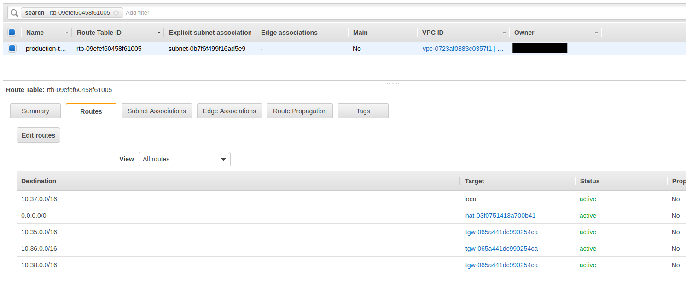

AWS Networks
=============

This is a series of modules to help build a global AWS transit gateway network.

# Creation flow:

## [1] transit-gateway
Creates a Transit Gateway

## [2] VPC
Create a VPC or use an exiting VPC that will connect up to the Transit Gateway

## [3] tg-internal-attach-vpc / tg-external-attach-vpc
The `internal` one uses one AWS account while the `external` one uses two AWS accounts.

The `external` module uses the `./_env_defaults/transit-gateway.tfvars` credential file to handle orchestrating resources in two accounts.  The first AWS account owns the Transit Gateway and the second AWS account is where you want to attach the Transit Gateway to.  This module will share the Transit Gateway from the first AWS account with the second AWS account and then accept it on both sides.  Then it will set it up to connect to the second's AWS account's VPC.

It will create:
* 3 subnets created so that the transit gateway can route into
* the TG needs to be in all subnets/zones if you want to route there
* transit gateway attachment to the test-vpc
* routes in the vpc route table associated with these subnets

## [4] transit-gateway-route-table
* This route table should be owned by the infrastructure AWS account
* These are all of the routes routing through the Transit Gateway
* The individual sub accounts should not have to add this step because they do not control the global Transit Network routing

## [5] add-tg-routes
	-These are individual routes that goes into the VPC route table
	-This should go into the local env where the VPC lives and that AWS account should launch this since they own the routes to their own VPC.

### This holds
The input variables for the `route_table_id_list` and the `routes-list` are the destination routes from the perspective of the subnet(s) this VPC route-table is associated with wants to route to.

It will set these routes and then set the destination to the Transit Gateway.

# A detailed walk through on how to troubleshoot a routing path through the AWS Transit Gateway
Troubleshooting a path through the transit gateway can seem like a hard task since you won't have visibility into every single piece of networking that the packet will go through.  By following a systematic approach you can make sure that everything that is needed to be able to route successfully from an EC2 host in one VPC in a region going through a transit gateway to another region and back down to another EC2 host in that VPC is setup correctly.

Im not going to lie.  This is a very tedious troubleshooting scenario.  If the IDs for each piece don't match up or if the CIDR range is no correct for a route table, trying to reach the other side via a ping or opening a connection to the other host will just fail silently.  We don't have visibility into AWS's routers to see where it is failing on this path.

In the following diagram we are going to map out how `EC2-1` will reach `EC2-2` and trace out the path.

As you can see, to make this setup work, there are a bunch of components to it.  The main items to look at are the correct routing tables associated with each components and are the correct routes in there?

Lets start.

## [1] Transit Gateway Configuration (us-west-2)
The first thing to check is to make sure the Transit Gateway is setup correctly.  Without this, you will not be able to add the routes to the EC2's instances routing tables.

In the AWS console go to: VPC->Transit Gateway

You should have a Transit Gateway here =)

### Attachments
The Transit Gateway has a bunch of functionality and ways you can use it and it is just a resource.  You have to attach this resource to something.

I have highlighted the second row (we'll talk about the first row later on).  This is a Transit Gateway attachment to a VPC.  This binds the transit gateway to the VPC where our `EC2-1` host lives.

Another important thing is to note the `Subnet IDs` in this page.  These are not the subnets that our `EC2-1` host is in but these are subnets in the same VPC.  For the Transit Gateway to route properly, it has to be in all of the AWS Availability Zones that you want it to route into for that VPC.  There are 3 subnets here because we are in 3 different availability zones.  This is a side fact that you will just have to remember on how the Transit Gateway works.  

## [2] EC2-1 Instance Configuration (us-west-2)

We have the instance named `EC2-1` which is in the us-west-2 region:

There two things we want to check in here.  

Note: You will notice that this subnet is not in the list of subnets in the Transit Gateway Attachments.  It doesn't have to be.

### Check is the EC2-1's security group
The first thing to check is the `EC2-1`'s security group:

Make sure that it is allowing network traffic in.  This is showing it is allowing everything in.

### The EC2-1's subnet settings
The second thing is to click on the `Subnet ID`.  When you get on that page, you can click on the `Route Table` tab and it will show you the following:

The following is the route table that is associated with this subnet and the routing configurations for it.  It lists out destination CIDR ranges where traffic to go and where it should send that traffic via the `Target` location.

Per our network above, the `EC2-2` host we are trying to reach is on the `10.35.0.0/16` network.  This route table don't have all of the information on how to get there but it knows the next hop on where it should go.  Also per our network diagram above, the next hop would be the Transit Gateway in this region that is attached to this VPC.  In this case, the transit gateway ID is `tgw-065a441dc990254ca`.  You can also see that this is the only transit gateway in this region for us which means that all othe routes to the other parts of the network will go through this transit gateway also.  You will notice that the other routes point to the same transit gateway.  That is because to get traffic to those networks, we just have to push the packets to this transit gateway and this transit gateway will handle forwarding it onward for us (per it's own configurations which we will go through below).

If you don't have the proper routes here you can click on the `Route Table` link (`rtb-09efef60458f61005 | production-test-vpc`) and that will bring you to the routing table's configuration.  From here, you can click on the `Routes` tab and add the destination CIDR and to which Transit Gateway should be the next hop.

## [3] Transit Gateway Peering Attachment (us-west-2)
Earlier we looked at the VPC attachment.  The following hightlights the peering attachment.  This attachment peers this Transit Gateway with another Transit Gateway.  In this case, it is peered with a Transit Gateway in `us-east-1`.

We will need this peering attachment active to continue to push traffic through to the other side.

## [4] Transit Gateway Route Table (us-west-2)
The Transit Gateway routing table is similar to the previous VPC routing table we were looking at.  It basicially needs the same information but the next hop is the peering connection.  The reason we have yet another routing table is becuase a Transit Gateway is a hub and spoke device.  This Transit Gateway can be connected up to multiple Transit Gateway or other devices like a VPN or a router.  This then mean that you need to know where to route traffic to and at which endpoint to send that traffic to.

In this setup it is fairly simple since there is only one other Transit Gateway and our VPC.  We have the `10.37.0.0/16` route pointed to our VPC and the route to `EC2-2` (10.35.0.0/16) pointed to the only peering connection we have in this setup.

## [5] Transit Gateway Configuration (us-east-1)
Now we start to look on the other side in `us-east-1`'s configuration to make sure it is correct.  This configuration is essentially the same as what we have gone through above.  We will go through the same sequence but with `us-east-1'`s configs.  I will only point out the differences here and not repeat what was sadi above.

Again, here we have a Transit Gateway (no picture).  The Transit Gateway itself don't have much configurations.  The interesting bits to it are in it's attachments.

## [6] Transit Gateway Attachments (us-east-1)
This Transit Gateway attchement is a little bit more interesting than the one in the other region because this is the "hub".  Both us-west-2 and us-east-2 peers with this Transit Gateway.  It just has more attachments and the configuration is about the same.

We want to make sure the VPC where the `EC2-2` instance is located in is attached here and for this particular troubleshooting exercise we only care about the peering with `us-west-2` is active.

## [7] EC2-2 Instance configuration (us-east-1)
Let's jump over to the `EC2-2`'s configuration and start there.

We want to check the same thing as we did before.  The security group and then click on the `Subnet ID`.

### VPC route table
This route table is the same as the other sides.  We just want to make sure everything is correct in here.

We want to make sure there is a route to the `10.37.0.0/16` subnet through the Transit Gateway.  Since we only have one Transit Gateway in each region for this example scenario, it is pretty hard to get this wrong but if you have more than one Transit Gateway in a region, make sure the IDs matches up to the correct one.  If you don't the packets wouldn't get to the final destination and it would basically silently fail here or at any other point where the IDs don't match up.

## [8] Transit Gateway Route Table (us-east-1)
Same thing here as above.  This is the Transit Gateway's route table with basically the same info as the VPC route table but just on another level.

What we want to note here is that the destination route for this side we want to get to is `10.37.0.0/16` and that the route table points this destination CIDR to the correct Transit Gateway peer.  Rememer in this region this Transit Gateway is the hub connecting two different regions to it.  

# Conclusion
Yes, this is tedious.  I wish it wasn't so.  You have to maticulously go through the path and make sure that each route table is in place and that the IDs that it is using is the correct one.  There isn't such great visiblity into the networking and this is the only way I found that is effective.  If there is a routing problem, I first make sure everything is in the correct place.  Then expand my troubleshooting efforts out from there.

